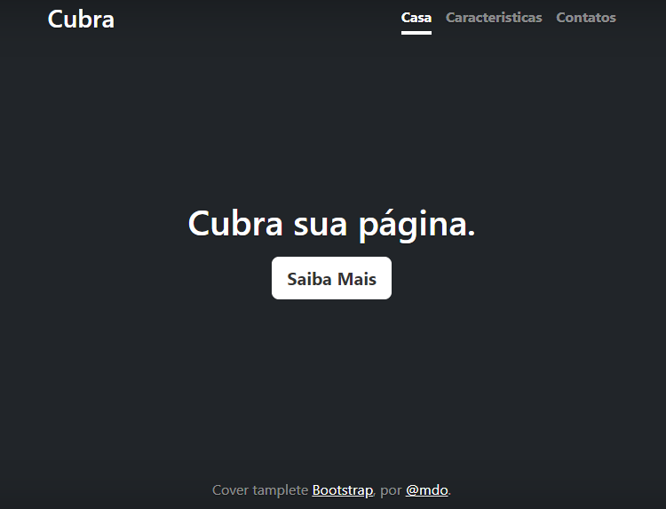

# índice

[ Portfolio-pessoal](#portfolio-pessoal)  
[Descrição](#descri%C3%A7%C3%A3o)  
[Introdução](#introdu%C3%A7%C3%A3o)  
[Funcionalidades](#funcionalidades)  
[Tecnologias utilizadas](#tecnologias-utilizadas)  
[Fontes consultadas](#fontes-consultadas)  
[Autores](#autores)  

# Portfolio-pessoal image.png

Projeto criado utilizando exemplo do boostrap para o ensino de uso do README e do boostrap

## Descrição
A partir das aulas de Programação Web, com o professor Leonardo Rocha, ele nos ensinou a documentar este projeto com o README para documentá-lo no GitHub, um meio para aprendermos melhor nossa escrita na programação e, consequentemente, entendermos melhor também aquilo que estamos fazendo e usando.

## Introdução
O projeto foi feito com a principal funcionalidade de aprendermos a usar o Bootstrap e a documentá-lo com o README, comitando-o diretamente para o GitHub.

## Funcionalidades

## Tecnologias utilizadas
* VS Code(Visual Code)

 * Bootstrap

 * Github

 * HTML

 * CSS

## Fontes consultadas

## Autores
*Gabriella